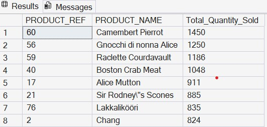
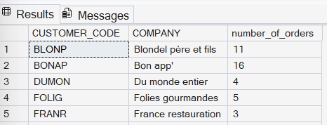

# 📊 SQL Sales Database Analysis

Analysing a B2B sales database (companies, orders, products suppliers, employees) to answer real business questions using SQL Server — uncovering revenue concentration, top-performing 
products, and sales team performance.

## 📌 Overview

This project simulates a business-to-business sales environment, where customers are companies (not individual shoppers) placing repeat orders. Each query answers a specific question a sales  or operations manager might genuinely ask — which customers drive the most revenue, which products sell best, and how evenly sales performance is spread across the team.

**Tools:** SQL Server 

## 🗃️ Database Schema

| Table | Purpose |
|---|---|
| CUSTOMERS | Customer companies and contact details |
| ORDERS | Customer orders and shipping information |
| ORDER_DETAILS | Line items (products, quantity, price) per order |
| PRODUCTS | Product catalogue and inventory |
| CATEGORIES | Product categories |
| SUPPLIERS | Product suppliers |
| EMPLOYEES | Staff handling orders |

**Relationships:** Customers → Orders → Order Details ← Products ← Categories / Suppliers · Employees → Orders


## 🔍 Business questions & findings

### 1. Which products dr
ive the most volume?
**Question:** Which products should we prioritise for restocking and promotion?

```sql
SELECT 
    P.PRODUCT_REF,
    P.PRODUCT_NAME,
    SUM(OD.QUANTITY) AS Total_Quantity_Sold
FROM ORDER_DETAILS OD
JOIN PRODUCTS P 
    ON OD.PRODUCT_REF = P.PRODUCT_REF
GROUP BY 
    P.PRODUCT_REF, 
    P.PRODUCT_NAME
ORDER BY 
    Total_Quantity_Sold DESC;
```

**Output** 


**Insight:** [ e.g. "Sales are concentrated — the top X products account for Y% of total volume." ]

---

### 2. Who are our highest-value customers?
**Question:** Which customers contribute the most revenue, and should be prioritised for account management?

```sql
SELECT 
    C.CUSTOMER_CODE,
    C.COMPANY,
    SUM(OD.QUANTITY * OD.UNIT_PRICE * (1 - OD.DISCOUNT)) AS Customer_Spend,
    ROUND(
        SUM(OD.QUANTITY * OD.UNIT_PRICE * (1 - OD.DISCOUNT)) * 100.0 
        / (SELECT SUM(QUANTITY * UNIT_PRICE * (1 - DISCOUNT)) FROM ORDER_DETAILS), 
        2
    ) AS Percent_Of_Total_Revenue
FROM CUSTOMERS C
JOIN ORDERS O 
    ON C.CUSTOMER_CODE = O.CUSTOMER_CODE
JOIN ORDER_DETAILS OD 
    ON O.ORDER_NUMBER = OD.ORDER_NUMBER
GROUP BY 
    C.CUSTOMER_CODE, 
    C.COMPANY
ORDER BY 
    Customer_Spend DESC;   
```
**Output**


**Insight:** Our top 5 customers (5.6% of our 89-customer base) contribute 29.31% of total revenue — a strong signal for where to prioritise account management and retention effort.

---

### 3. How is sales performance distributed across employees?
**Question:** Are sales concentrated among a few top performers, or evenly spread?

```sql
SELECT 
    E.FIRST_NAME, 
    E.LAST_NAME,
    SUM(OD.QUANTITY * OD.UNIT_PRICE * (1 - OD.DISCOUNT)) AS Total_Sales,
    ROUND(
        SUM(OD.QUANTITY * OD.UNIT_PRICE * (1 - OD.DISCOUNT)) * 100.0 
        / (SELECT SUM(QUANTITY * UNIT_PRICE * (1 - DISCOUNT)) FROM ORDER_DETAILS), 
        2
    ) AS Pct_Of_Total_Revenue
FROM EMPLOYEES E
JOIN ORDERS O ON E.EMPLOYEE_ID = O.EMPLOYEE_ID
JOIN ORDER_DETAILS OD ON O.ORDER_NUMBER = OD.ORDER_NUMBER
GROUP BY E.FIRST_NAME, E.LAST_NAME
ORDER BY Total_Sales DESC;
```
**Output**


**Insight:** 3 of 9 employees (33% of the sales team) generated 51.14% of total revenue — a moderate concentration, roughly 1.5x their proportional share. Worth understanding whether this reflects account size, tenure, or territory rather than assuming underperformance elsewhere.

---

### 4. Which suppliers provide beverages?
**Question:** Who are our current beverage suppliers, in case of supply chain risk or renegotiation?
```sql
SELECT DISTINCT 
    s.SUPPLIER_ID,
    s.COMPANY,
    s.ADDRESS,
    s.PHONE
FROM SUPPLIERS s
JOIN PRODUCTS p 
    ON s.SUPPLIER_ID = p.SUPPLIER_ID
JOIN CATEGORIES c 
    ON p.CATEGORY_CODE = c.CATEGORY_CODE
WHERE UPPER(c.CATEGORY_NAME) = 'Beverages';
```

**Output:**

---

### 5. Which customers have ordered every product in the catalogue?
**Question:** Identifying our most "complete" customers — useful for case studies or loyalty targeting.

```sql 
SELECT c.CUSTOMER_CODE, c.COMPANY, c.PHONE
FROM CUSTOMERS c
WHERE c.CUSTOMER_CODE IN (
    SELECT o.CUSTOMER_CODE
    FROM ORDERS o
    JOIN ORDER_DETAILS od ON o.ORDER_NUMBER = od.ORDER_NUMBER
    GROUP BY o.CUSTOMER_CODE
    HAVING COUNT(DISTINCT od.PRODUCT_REF) = (SELECT COUNT(*) FROM PRODUCTS)
);
``` 

**Output:** 

---

### 6. RANK PRODUCTS BY SALES WITHIN EACH CATEGORY — NOT JUST OVERALL
**Question:** Which product is the top performer *within its own category* — useful for category managers, not just overall bestseller lists?

```sql
SELECT 
    C.CATEGORY_NAME,
    P.PRODUCT_NAME,
    SUM(OD.QUANTITY) AS Units_Sold,
    RANK() OVER (PARTITION BY C.CATEGORY_NAME ORDER BY SUM(OD.QUANTITY) DESC) AS Rank_In_Category
FROM ORDER_DETAILS OD
JOIN PRODUCTS P ON OD.PRODUCT_REF = P.PRODUCT_REF
JOIN CATEGORIES C ON P.CATEGORY_CODE = C.CATEGORY_CODE
GROUP BY C.CATEGORY_NAME, P.PRODUCT_NAME
ORDER BY C.CATEGORY_NAME, Rank_In_Category;
```
**Output** 

---

### 7. RUNNING TOTAL OF MONTHLY REVENUE — TRACK CUMULATIVE GROWTH
**Question:** How is revenue accumulating month over month — are we on a growth trajectory?

```sql
SELECT 
    YEAR(O.ORDER_DATE) AS Order_Year,
    MONTH(O.ORDER_DATE) AS Order_Month_Num,
    SUM(OD.QUANTITY * OD.UNIT_PRICE * (1 - OD.DISCOUNT)) AS Monthly_Revenue,
    SUM(SUM(OD.QUANTITY * OD.UNIT_PRICE * (1 - OD.DISCOUNT))) 
        OVER (ORDER BY YEAR(O.ORDER_DATE), MONTH(O.ORDER_DATE)) AS Running_Total_Revenue
FROM ORDERS O
JOIN ORDER_DETAILS OD ON O.ORDER_NUMBER = OD.ORDER_NUMBER
GROUP BY YEAR(O.ORDER_DATE), MONTH(O.ORDER_DATE)
ORDER BY Order_Year, Order_Month_Num;​
```

**Output** 
---


### 8. EACH CUSTOMER'S SINGLE FAVOURITE PRODUCT
**Question:** For personalised outreach or upsell — what's each top customer's single most-ordered product?

```sql
SELECT Company, Product_Name, Units_Ordered
FROM (
    SELECT 
        C.COMPANY,
        P.PRODUCT_NAME,
        SUM(OD.QUANTITY) AS Units_Ordered,
        ROW_NUMBER() OVER (PARTITION BY C.COMPANY ORDER BY SUM(OD.QUANTITY) DESC) AS rating_number
    FROM CUSTOMERS C
    JOIN ORDERS O ON C.CUSTOMER_CODE = O.CUSTOMER_CODE
    JOIN ORDER_DETAILS OD ON O.ORDER_NUMBER = OD.ORDER_NUMBER
    JOIN PRODUCTS P ON OD.PRODUCT_REF = P.PRODUCT_REF
    GROUP BY C.COMPANY, P.PRODUCT_NAME
) ranked
WHERE rating_number = 1
ORDER BY Product_Name, Units_Ordered DESC;
```
**Output** 

---

### 9. How many orders came from France?
```sql
SELECT 
    c.CUSTOMER_CODE, c.COMPANY,
    COUNT(o.ORDER_NUMBER) AS number_of_orders
FROM CUSTOMERS c
LEFT JOIN ORDERS o 
    ON c.CUSTOMER_CODE = o.CUSTOMER_CODE
WHERE c.COUNTRY = 'France'
GROUP BY c.CUSTOMER_CODE, c.COMPANY;
```

**Output:** 

## ⚠️ Challenges & how I solved them

| Challenge | Resolution |
|---|---|
| Dataset used `DD/MM/YY` dates, causing conversion errors | Used `SET DATEFORMAT DMY` and standardised formats |
| Foreign key errors on insert | Learned to respect insertion order — parent tables before child tables |
| Decimal values failing on integer columns | Adjusted column types (e.g. `DECIMAL` for prices) |

## 💡 Key learnings

- Translating business questions into SQL logic, not just writing queries for their own sake
- Importance of referential integrity in relational schema design
- Debugging real data issues rather than working with clean, ready-made data
- Writing structured, readable SQL that others could pick up and follow

## 🚀 Next steps

- Build a Power BI / Tableau dashboard on top of these queries
- Extend into customer segmentation (RFM analysis)
