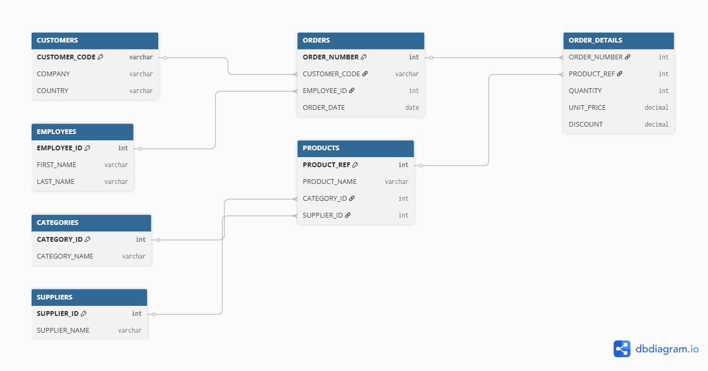
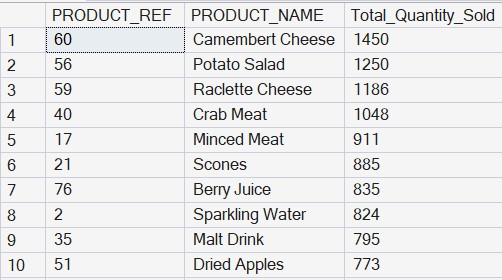
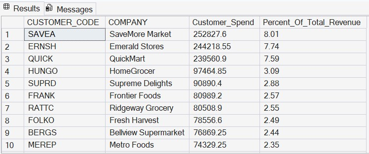
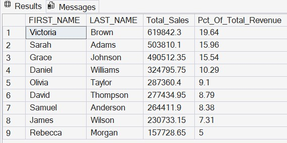
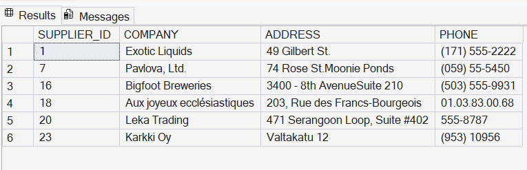
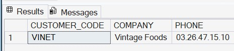
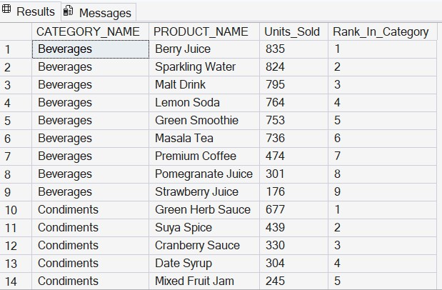
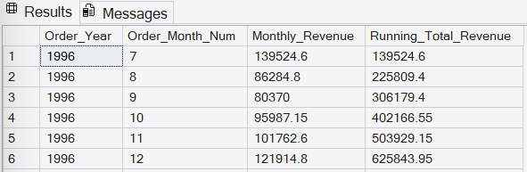
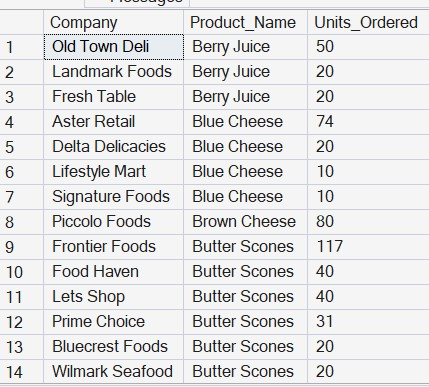
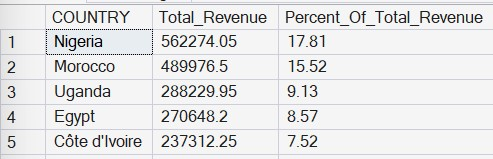

# 📊 SQL Sales Database Analysis

Analysing a Business-to-Business (B2B) sales database using **SQL Server** to answer practical business questions around customer value, product performance, supplier management, employee performance, and revenue trends.

---

# 📌 Overview

This project analyses a relational B2B sales database where customers are companies placing repeat orders. Using SQL Server, I translated real business questions into SQL queries to uncover insights that could support sales, operations, and inventory decisions.

Rather than simply writing SQL queries, the focus of this project is on extracting actionable business insights from relational data.

**Tools**

* SQL Server

---

# 🗃️ Database Schema

| Table         | Purpose                                                |
| ------------- | ------------------------------------------------------ |
| CUSTOMERS     | Customer companies and contact details                 |
| ORDERS        | Customer orders and shipping information               |
| ORDER_DETAILS | Order line items (products, quantity, price, discount) |
| PRODUCTS      | Product catalogue and inventory                        |
| CATEGORIES    | Product categories                                     |
| SUPPLIERS     | Product suppliers                                      |
| EMPLOYEES     | Employees responsible for customer orders              |

### Relationships

```
Customers
    │
    ▼
Orders
    │
    ▼
Order Details
   ▲      ▲
   │      │
Products  Employees
   │
   ├── Categories
   └── Suppliers
```

### Entity Relationship Diagram


---

# 🔍 Business Questions & Findings

## 1. Which products drive the highest sales volume?

**Business Question**

> Which products should we prioritise for restocking and promotion?

```sql
SELECT
    P.PRODUCT_REF,
    P.PRODUCT_NAME,
    SUM(OD.QUANTITY) AS Total_Quantity_Sold
FROM ORDER_DETAILS OD
JOIN PRODUCTS P
    ON OD.PRODUCT_REF = P.PRODUCT_REF
GROUP BY
    P.PRODUCT_REF,
    P.PRODUCT_NAME
ORDER BY
    Total_Quantity_Sold DESC;
```

**Output**




**Insight**

Product demand is concentrated among a relatively small group of products. These high-volume products should be prioritised for inventory planning and promotional campaigns, while lower-selling products may require stocking optimisation or demand review.

---

## 2. Who are our highest-value customers?

**Business Question**

> Which customers contribute the most revenue and should be prioritised for account management?

```sql
SELECT
    C.CUSTOMER_CODE,
    C.COMPANY,
    SUM(OD.QUANTITY * OD.UNIT_PRICE * (1 - OD.DISCOUNT)) AS Customer_Spend,
    ROUND(
        SUM(OD.QUANTITY * OD.UNIT_PRICE * (1 - OD.DISCOUNT)) * 100.0
        / (SELECT SUM(QUANTITY * UNIT_PRICE * (1 - DISCOUNT)) FROM ORDER_DETAILS),
        2
    ) AS Percent_Of_Total_Revenue
FROM CUSTOMERS C
JOIN ORDERS O
    ON C.CUSTOMER_CODE = O.CUSTOMER_CODE
JOIN ORDER_DETAILS OD
    ON O.ORDER_NUMBER = OD.ORDER_NUMBER
GROUP BY
    C.CUSTOMER_CODE,
    C.COMPANY
ORDER BY
    Customer_Spend DESC;
```

**Output**



**Insight**

The top five customers (5.6% of the 89-customer base) generated **29.31% of total revenue**, demonstrating that revenue is concentrated among a small number of key accounts. These customers should be prioritised for retention, relationship management, and personalised service.

---

## 3. How is sales performance distributed across employees?

**Business Question**

> Are sales concentrated among a few top performers or evenly distributed across the team?

```sql
SELECT
    E.FIRST_NAME,
    E.LAST_NAME,
    SUM(OD.QUANTITY * OD.UNIT_PRICE * (1 - OD.DISCOUNT)) AS Total_Sales,
    ROUND(
        SUM(OD.QUANTITY * OD.UNIT_PRICE * (1 - OD.DISCOUNT)) * 100.0
        / (SELECT SUM(QUANTITY * UNIT_PRICE * (1 - DISCOUNT)) FROM ORDER_DETAILS),
        2
    ) AS Pct_Of_Total_Revenue
FROM EMPLOYEES E
JOIN ORDERS O
    ON E.EMPLOYEE_ID = O.EMPLOYEE_ID
JOIN ORDER_DETAILS OD
    ON O.ORDER_NUMBER = OD.ORDER_NUMBER
GROUP BY
    E.FIRST_NAME,
    E.LAST_NAME
ORDER BY
    Total_Sales DESC;
```

**Output**



**Insight**

Three of the nine employees (33% of the sales team) generated **51.14% of total revenue**, indicating moderate sales concentration. This may reflect differences in customer portfolios, territories, or tenure rather than individual performance alone.

---

## 4. Which suppliers provide beverages?

**Business Question**

> Which suppliers currently provide beverage products?

```sql
SELECT DISTINCT
    S.SUPPLIER_ID,
    S.COMPANY,
    S.ADDRESS,
    S.PHONE
FROM SUPPLIERS S
JOIN PRODUCTS P
    ON S.SUPPLIER_ID = P.SUPPLIER_ID
JOIN CATEGORIES C
    ON P.CATEGORY_CODE = C.CATEGORY_CODE
WHERE UPPER(C.CATEGORY_NAME) = 'BEVERAGES';
```

**Output**



**Insight**

The query identifies the suppliers responsible for the beverage category, providing visibility into supplier dependency and supporting procurement planning, supplier negotiations, and contingency planning.

---

## 5. Which customers have ordered every product in the catalogue?

**Business Question**

> Which customers have purchased every available product?

```sql
SELECT
    C.CUSTOMER_CODE,
    C.COMPANY,
    C.PHONE
FROM CUSTOMERS C
WHERE C.CUSTOMER_CODE IN
(
    SELECT O.CUSTOMER_CODE
    FROM ORDERS O
    JOIN ORDER_DETAILS OD
        ON O.ORDER_NUMBER = OD.ORDER_NUMBER
    GROUP BY O.CUSTOMER_CODE
    HAVING COUNT(DISTINCT OD.PRODUCT_REF) =
        (SELECT COUNT(*) FROM PRODUCTS)
);
```

**Output**



**Insight**

Only Vintage Foods has purchased every product in the catalogue, making the company valuable candidate for loyalty programmes, customer success stories, and premium account management.

---

## 6. Which products perform best within each category?

**Business Question**

> Which products are category leaders rather than simply overall best sellers?

```sql
SELECT
    C.CATEGORY_NAME,
    P.PRODUCT_NAME,
    SUM(OD.QUANTITY) AS Units_Sold,
    RANK() OVER
    (
        PARTITION BY C.CATEGORY_NAME
        ORDER BY SUM(OD.QUANTITY) DESC
    ) AS Rank_In_Category
FROM ORDER_DETAILS OD
JOIN PRODUCTS P
    ON OD.PRODUCT_REF = P.PRODUCT_REF
JOIN CATEGORIES C
    ON P.CATEGORY_CODE = C.CATEGORY_CODE
GROUP BY
    C.CATEGORY_NAME,
    P.PRODUCT_NAME
ORDER BY
    C.CATEGORY_NAME,
    Rank_In_Category;
```

**Output**




**Insight**

Ranking products within their own categories reveals category leaders that may not appear among the overall best-selling products. This provides more meaningful insights for category managers and merchandising decisions.

---

## 7. How has revenue accumulated over time?

**Business Question**

> How has revenue grown month by month?

```sql
SELECT
    FORMAT(O.ORDER_DATE, 'MMM yyyy') AS [Month],
    SUM(OD.QUANTITY * OD.UNIT_PRICE * (1 - OD.DISCOUNT)) AS Monthly_Revenue,
    SUM(
        SUM(OD.QUANTITY * OD.UNIT_PRICE * (1 - OD.DISCOUNT))
    ) OVER
    (
        ORDER BY YEAR(O.ORDER_DATE), MONTH(O.ORDER_DATE)
    ) AS Running_Total_Revenue
FROM ORDERS O
JOIN ORDER_DETAILS OD
    ON O.ORDER_NUMBER = OD.ORDER_NUMBER
GROUP BY
    YEAR(O.ORDER_DATE),
    MONTH(O.ORDER_DATE),
    FORMAT(O.ORDER_DATE, 'MMM yyyy')
ORDER BY
    YEAR(O.ORDER_DATE),
    MONTH(O.ORDER_DATE);
```

**Output**



**Insight**

Revenue experienced normal month-to-month fluctuations throughout the period analysed, with periods of decline followed by recovery. The cumulative revenue trend continued to increase over time, providing a clearer picture of long-term business performance than monthly revenue alone.

---

## 8. What is each customer's favourite product?

**Business Question**

> What is each customer's most frequently ordered product?

```sql
SELECT Company, Product_Name, Units_Ordered
FROM
(
    SELECT
        C.COMPANY,
        P.PRODUCT_NAME,
        SUM(OD.QUANTITY) AS Units_Ordered,
        ROW_NUMBER() OVER
        (
            PARTITION BY C.COMPANY
            ORDER BY SUM(OD.QUANTITY) DESC
        ) AS Rating_Number
    FROM CUSTOMERS C
    JOIN ORDERS O
        ON C.CUSTOMER_CODE = O.CUSTOMER_CODE
    JOIN ORDER_DETAILS OD
        ON O.ORDER_NUMBER = OD.ORDER_NUMBER
    JOIN PRODUCTS P
        ON OD.PRODUCT_REF = P.PRODUCT_REF
    GROUP BY
        C.COMPANY,
        P.PRODUCT_NAME
) Ranked
WHERE Rating_Number = 1;
```

**Output**

 

**Insight**

Each customer has a clearly identifiable most frequently ordered product, revealing unique purchasing preferences. Some customers repeatedly order high volumes of a single product (up to 75 units), while others display more modest purchasing patterns. These insights can help sales teams personalise customer interactions, recommend complementary products, and improve inventory planning by anticipating repeat demand.

---

## 9. Which countries generate the highest revenue?

**Business Question**

> Which markets generate the most revenue, and where should the business focus its sales efforts?

```sql
SELECT
    C.COUNTRY,
    SUM(OD.QUANTITY * OD.UNIT_PRICE * (1 - OD.DISCOUNT)) AS Total_Revenue,
    ROUND(
        SUM(OD.QUANTITY * OD.UNIT_PRICE * (1 - OD.DISCOUNT))
        *100.0/
        (
            SELECT SUM(QUANTITY*UNIT_PRICE*(1-DISCOUNT))
            FROM ORDER_DETAILS
        ),
        2
    ) AS Percent_Of_Total_Revenue
FROM CUSTOMERS C
JOIN ORDERS O
    ON C.CUSTOMER_CODE = O.CUSTOMER_CODE
JOIN ORDER_DETAILS OD
    ON O.ORDER_NUMBER = OD.ORDER_NUMBER
GROUP BY
    C.COUNTRY
ORDER BY
    Total_Revenue DESC;
```

**Output**

 


**Insight**

Although the business serves customers across 21 countries, revenue is concentrated in a relatively small number of markets. Nigeria and the Morocco alone generated 33.33% of total revenue, suggesting that a few key markets drive a significant share of sales. Understanding this geographic concentration can help prioritise regional sales strategies while identifying opportunities to grow lower-performing markets.

---
## 🔍 Key Findings

- Revenue is concentrated among a relatively small group of customers, highlighting the importance of customer retention and strategic account management.
- Sales performance varies across employees, suggesting differences in customer portfolios, territories, or sales opportunities.
- Product demand is uneven across the catalogue, making inventory prioritisation more effective than treating all products equally.
- A small number of markets contribute a significant share of total revenue, highlighting priority regions for future sales growth.
- Monthly revenue shows an overall upward trend, indicating steady business growth over the analysis period.

---

## 📈 Business Impact

This analysis demonstrates how SQL can support data-driven business decisions by:

- Identifying high-value customers for targeted account management and retention.
- Revealing top-selling products to improve inventory planning and promotional strategies.
- Evaluating employee sales performance to support coaching, workload balancing, and performance monitoring.
- Monitoring monthly and cumulative revenue trends to track business growth over time.
- Supporting supplier and category management through product performance analysis.
- Understanding customer purchasing behaviour to enable targeted marketing and cross-selling opportunities.
- Identifying high-performing markets to guide strategic sales investment and future expansion.
---

# ⚠️ Challenges & Solutions

| Challenge                                              | Solution                                                                   |
| ------------------------------------------------------ | -------------------------------------------------------------------------- |
| Date conversion errors caused by DD/MM/YYYY formatting | Used `SET DATEFORMAT DMY` to standardise date interpretation               |
| Foreign key constraint errors during data loading      | Loaded parent tables before child tables to preserve referential integrity |
| Decimal values failing on integer columns              | Updated data types (e.g., `DECIMAL`) to match the source data              |

---

# 📂 Dataset

This project uses a relational sales database containing information on customers, orders, products, suppliers, employees, and product categories. The dataset is designed to simulate a real-world B2B sales environment and support business-focused SQL analysis.

---
